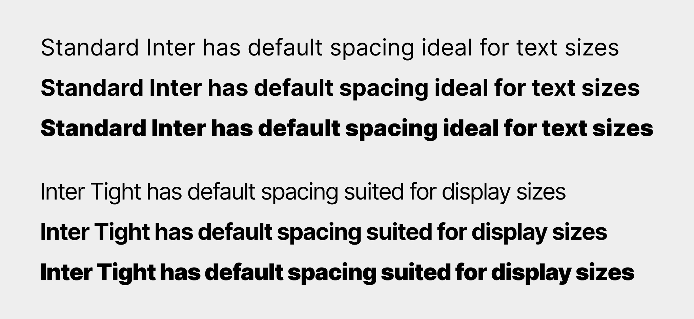

This is a specialized version of [Inter](https://github.com/rsms/inter)
with tighter spacing, for use Google Workspace which does not provide control over
letter spacing.
This version does _not_ receive updates and improvements from standard Inter.

Space differences in UPM, compared to Inter:

- Thin:      0 U
- Regular: -48 U
- Black:   -24 U

### Build the fonts

1. Clone the repository and open the CLI from that directory or go there with `cd path/to/local/repo` (you can also drap and drop the directory directly in the CLI)

2. Create a virtual environment in the project directory to install the required python package:
    
    `python3 -m venv env`

3. Activate the virtual environment:
    
    `source env/bin/activate`

4. Install `gftools`:
    
    `pip install gftools`

5. Now you can build the font:
    
    From the sources directory: `cd sources`
    
    Use gftools builder: `gftools builder config.yaml`